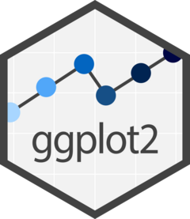
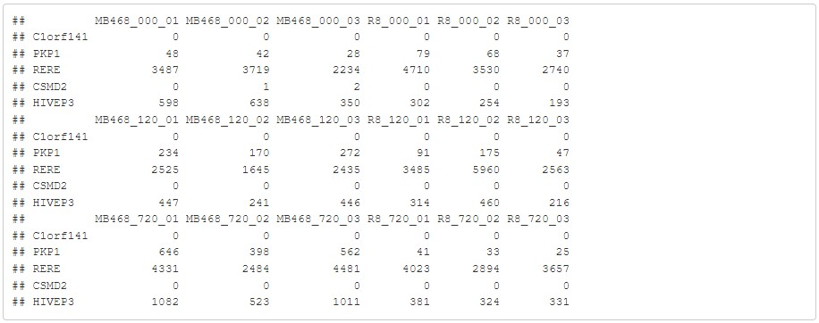
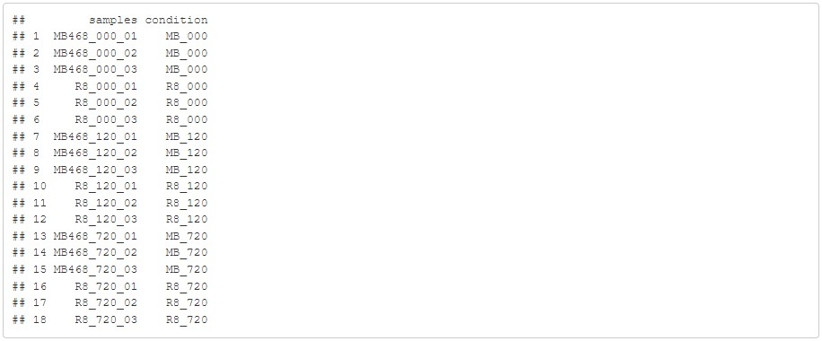
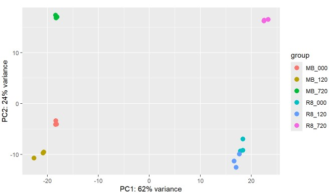

# [Franco](https://github.com/altsplicer) / [***DEseq2 PCA***](https://altsplicer.github.io/PCA_script/PCA_RMD.html)

[](#nolink)
[](#nolink)

## Overview
This a walk-through of the PCA plot script used for Met Cancer project in the Hertel and Kaiser lab. There is a built in PCA command in the DEseq2 R package. For a Deseq2 tutorial/walkthrough see https://altsplicer.github.io/DEseq2_Script/DESEQ2_met.html. You can also see this walk-through via this [link](https://altsplicer.github.io/Methionine-PCA/PCA_RMD.html). PCA plots are used as QC check in your RNA-seq analysis. To explore the similarity of our samples and identify outliers.For a more indepth view of QC checks such as PCA plots and unsupervised clustering see the following [link](https://hbctraining.github.io/DGE_workshop/lessons/03_DGE_QC_analysis.html).

## Install and Load DEseq2 and ggplot2 in R studio

```{r}
# installion of DESEQ2 via Biocmanager and ggplot2
# BiocManager::install("DESeq2")
# install.packages("ggplot2")
# Call required packages
library(DESeq2)
library(ggplot2)
```

## Locate your reads count file

The input file will be a the output text file from the STAR aligner, geneCounts or a feature counts text file.
```{r}
# location of read counts text file
# infile = "./example.txt"
infile = "./com_0v120v720counts.txt"
```


## Setup the experimental design

This will set up the experimental design that will be used to run the DEseq2 analysis. In this case we have 3 reps per condition and 8 conditions. 2 cells lines under 4 media conditions.
```{r}
# design for 3 reps, 6 conditions
design = c( "3", "3", "3", "3", "3", "3")
# design for 2 reps 4 conditions
# design = c( "2", "2", "2", "2")

# call the design and transform them into a integer character.
reps1 = as.integer(design[1])
reps2 = as.integer(design[2])
reps3 = as.integer(design[3])
reps4 = as.integer(design[4])
reps5 = as.integer(design[5])
reps6 = as.integer(design[6])

# Set up the conditions based on the experimental setup.
# cond1 = rep("cond1", reps1)
# cond2 = rep("cond2", reps2)

cond1 = rep("MB_000", reps1)
cond2 = rep("R8_000", reps2)
cond3 = rep("MB_120", reps3)
cond4 = rep("R8_120", reps4)
cond5 = rep("MB_720", reps5)
cond6 = rep("R8_720", reps6)
```

## Read the data from the standard input.
```{r}
counts = read.table(infile, header=TRUE, sep="\t", row.names=1 )

# Optional, head the counts to view the formatting and adjust accordingly
#head(counts, 5)
```

# Edit the counts matrix
The count data so the only the read counts and gene name remains.
```{r}
# Assume the last columns are the count matrix.
#idx = ncol(counts) - (reps1 + reps2)
idx = ncol(counts) - (reps1 + reps2 + reps3 + reps4 + reps5 + reps6)

# Cut out the valid columns.
# counts = counts[-c(1:idx)]
counts = counts[-c(1:idx)]

# Some tools generate the estimated counts as real numbers
# DESeq 2 allows only integers. We need to convert real numbers to rounded integers.
numeric_idx = sapply(counts, mode) == 'numeric'
counts[numeric_idx] = round(counts[numeric_idx], 0)
head(counts, 5)
```
[](#nolink)

# Build the dataset names and conditions
```{r}
samples = names(counts)
condition = factor(c(cond1, cond2, cond3, cond4, cond5, cond6))
colData = data.frame(samples=samples, condition=condition)

# You can view the dataset by calling the following
samples
```
[](#nolink)
```{r}
condition
```
[](#nolink)

```{r}
colData
```
[](#nolink)

# Create DESEq2 dataset.
```{r}
#dds = DESeqDataSetFromMatrix(countData=counts, colData=colData, design = ~condition)
dds = DESeqDataSetFromMatrix(countData=counts, colData=colData, design = ~condition)

```
[](#nolink)

# Run deseq2.
```{r}
dds = DESeq(dds)
```
[](#nolink)

## Transform counts for PCA
vst this will transform your counts for data visualization.

```{r}
# object refers to a DESeqDataSet or a matrix of counts.
# blind see documentation for an explanation.
#vst(object, blind=TRUE)
vsdata <- vst(dds, blind=TRUE) 

```

## Plot a simple PCA plot
```{r}
plotPCA(vsdata, intgroup=c("condition"))
```
[](#nolink)
[](#nolink)

## Further Customization

Run the previous command but instead of plotting a PCA plot your output will return a data frame and store it in "pcaData".
```{r}
# pcaData <- plotPCA(vsdata, intgroup=c("condition", "type"), returnData=TRUE)
pcaData <- plotPCA(vsdata, intgroup=c("condition"), returnData=TRUE)

#retrieve the percent variance for PC1 and PC2 in the PCA plot
percentVar <- round(100 * attr(pcaData, "percentVar"))
```
[](#nolink)

Plot the PCA plot using ggplot and the "pcaData" data frame made from the plotPCA command. 
```{r}
# Use ggplot2 options to change the plot colors, font size and many other plot options.
ggplot(pcaData, aes(PC1, PC2, color=condition)) +
  geom_point(size=10,alpha=0.5) +
  xlab(paste0("PC1: ",percentVar[1],"% variance")) +
  ylab(paste0("PC2: ",percentVar[2],"% variance")) + 
  coord_fixed() + scale_color_manual(values = c("#1565C0","#2196F3","#64B5F6","#641E16","#C0392B","#E6B0AA")) + 
  theme(legend.title=element_blank()) + theme(axis.title=element_text(size=14,face="bold")) + theme(axis.text.x=element_text(size=12))+ 
  theme(axis.text.y=element_text(size=12)) + theme(legend.text=element_text(size=10))
 
```
[](#nolink)


## Acknowledgments

1. Page header logo is adapted from images: [DESeq2-Michael-Love.png] 
